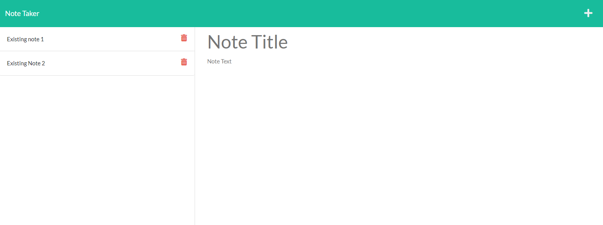

# Express-Note-Taker

**This project showcases basic node.js server functionality using the express.js library and deployment using heroku. The user is directed to a landing page where they can then select the [Get Started] button to visit the application. The application allows the user to enter, retrieve and delete notes using api routes. Nothing fancy here, just good working code. A bigger app would warrant code modularization and router functionality. Getting the routes to work and thinking through the save and delete functions was rewarding once I figured it out.**

## Table of Contents

[Link to Deployed Site](#link-to-deployed-site)

[Installation Instructions](#installation-instructions)

[Contribution Guidelines](#contribution-guidelines)

[Collaboration Credits](#collaboration-credits)

[Questions](#questions)

[License](#license)

## Link to Deployed Site

https://agile-dawn-36237.herokuapp.com/
## Installation Instructions

No istallation is necessary but those who wish to visit the code, run and debug locally can simply clone the repository and run npm install to set up packages.
## Contribution Guidelines

Those who wish to contribute may create issues and submit pull requests if desired. Please reach out as this repo is not closely monitored.
## Collaboration Credits

This project contains starter code located here https://github.com/coding-boot-camp/miniature-eureka
## Questions
For information about the developer, see my [GitHub Profile](https://github.com/eclevela-1234)

For general questions, please email me: eliothead@live.com
## License
Copyright (c)  2022 by [eclevela-1234](https://github.com/eclevela-1234)

MIT License

Permission is hereby granted, free of charge, to any person obtaining a copy
of this software and associated documentation files (the "Software"), to deal
in the Software without restriction, including without limitation the rights
to use, copy, modify, merge, publish, distribute, sublicense, and/or sell
copies of the Software, and to permit persons to whom the Software is
furnished to do so, subject to the following conditions:

The above copyright notice and this permission notice shall be included in all
copies or substantial portions of the Software.

THE SOFTWARE IS PROVIDED "AS IS", WITHOUT WARRANTY OF ANY KIND, EXPRESS OR
IMPLIED, INCLUDING BUT NOT LIMITED TO THE WARRANTIES OF MERCHANTABILITY,
FITNESS FOR A PARTICULAR PURPOSE AND NONINFRINGEMENT. IN NO EVENT SHALL THE
AUTHORS OR COPYRIGHT HOLDERS BE LIABLE FOR ANY CLAIM, DAMAGES OR OTHER
LIABILITY, WHETHER IN AN ACTION OF CONTRACT, TORT OR OTHERWISE, ARISING FROM,
OUT OF OR IN CONNECTION WITH THE SOFTWARE OR THE USE OR OTHER DEALINGS IN THE
SOFTWARE.

For more information visit https://opensource.org/licenses/MIT

